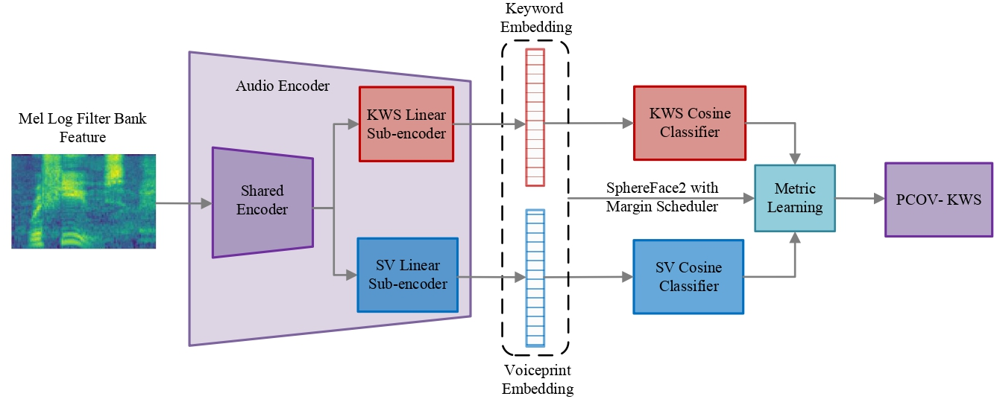

# PCOV-KWS: Multi-task Learning for Personalized Customizable Open Vocabulary Keyword Spotting

[](https://github.com/Jotakak-yu/PCOV-KWS-Inference) [](https://arxiv.org/abs/xxxx.xxxxx)

We have now released a kws-only version inference framework based on our proposed TDResNeXt backbone. Soon, we will release the full PCOV-KWS model supporting both sv and kws.

## Model Architecture


## Usage

First, place your prepared wake word audio files in subfolders named after the wake words under the wakewords directory.

```bash
conda create -n kws python=3.9
conda activate kws
pip install -r requirements.txt

# generate hotword embedding
python -m pcov_kws.generate_reference --input-dir ./wakewords --output-dir ./pcov_kws/sample_refs --model-type tdsp2

# start PCOV-KWS server
streamlit run webui.py
```

## Acknowledgements
We would like to thank the following projects:
* [EfficientWord-Net](https://github.com/Ant-Brain/EfficientWord-Net)
* [LibMTL](https://github.com/median-research-group/LibMTL)
* [kaldi-native-fbank](https://github.com/csukuangfj/kaldi-native-fbank)